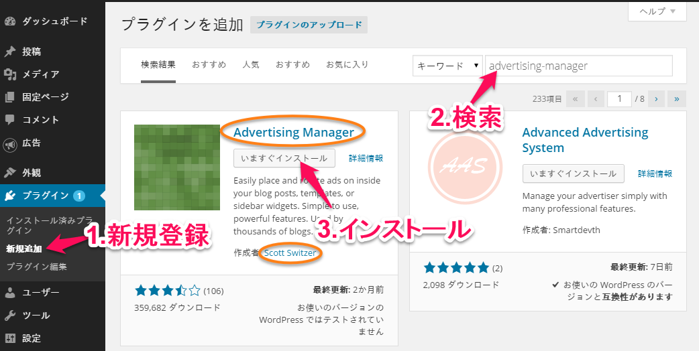
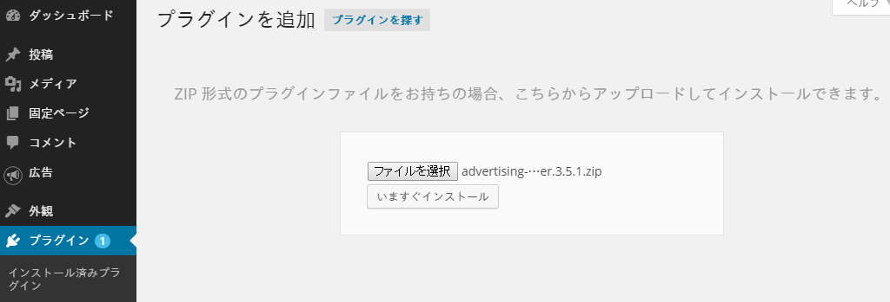
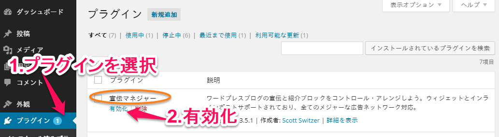
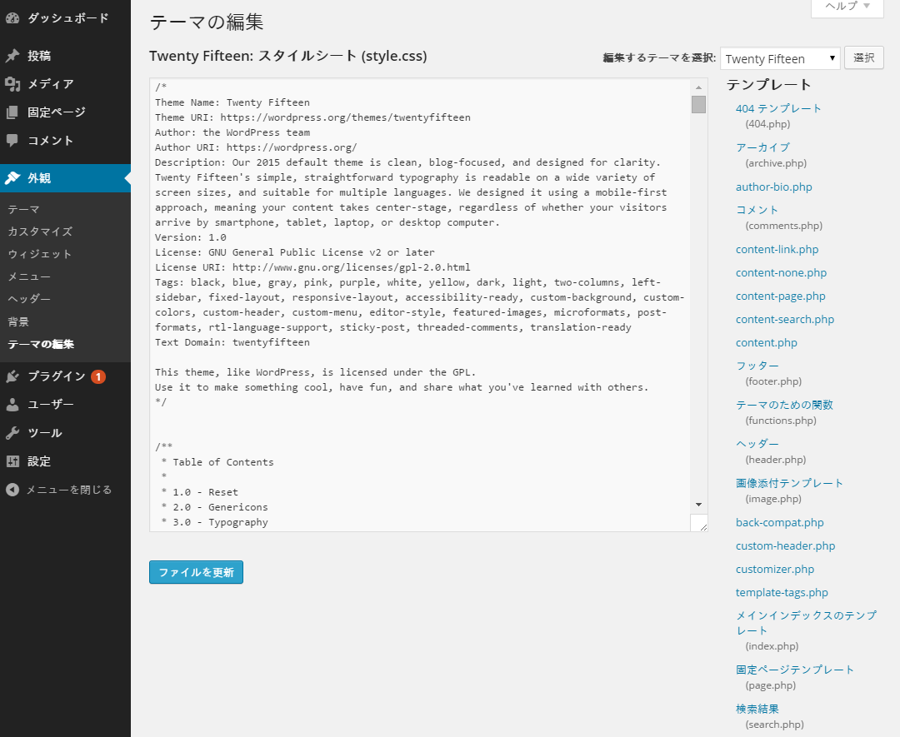
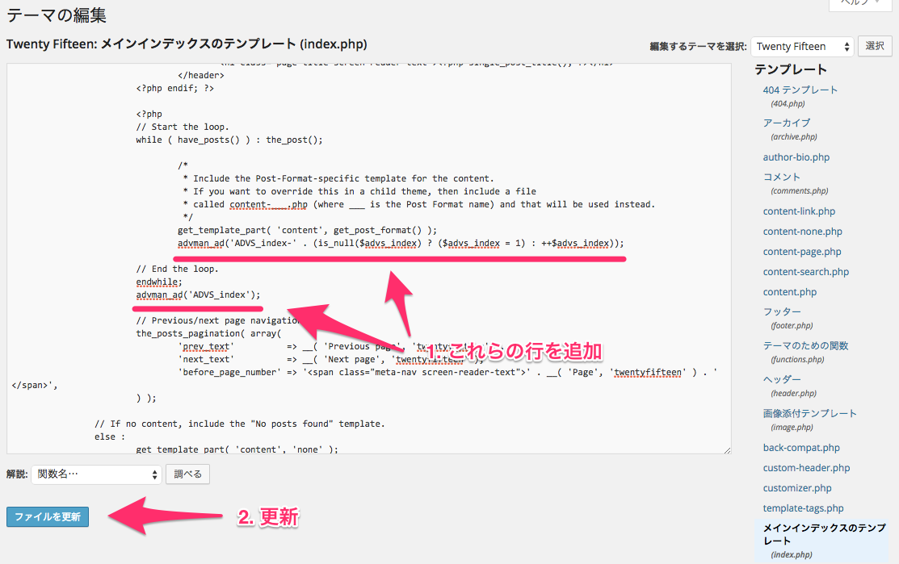
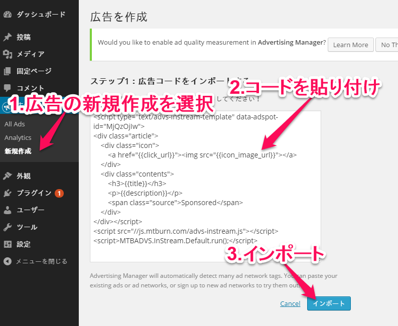
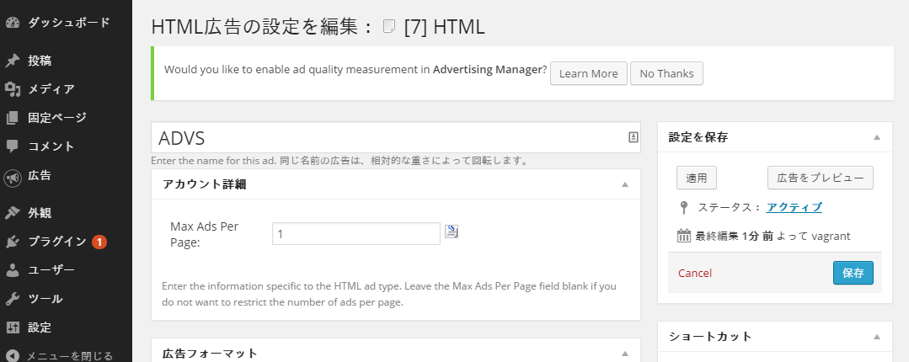
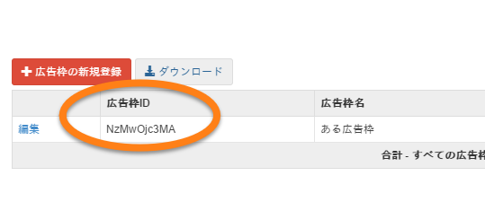

# 目次
- [WordPressプラグイン「Advertising Manager」のインストール](#install)
  - [「Advertising Manager」をインストールする](#install1)
  - [「Advertising Manager」を有効にする](#install2)
- [「Advertising Manager」の設定](#setup)
  - [テンプレートの編集](#setup1)
	- [追加手順](#setup1-1)
  - [「Adveritising Manager」の広告枠設定](#setup2)
	- [広告テンプレートの設定](#setup2-1)
	- [インフィード広告の表示](#setup2-2)


<a name="install"></a>
# WordPressプラグイン「Advertising Manager」のインストール

<a name="install1"></a>
## 「Advertising Manager」をインストールする

一般的なやり方は下記の3通りになります。

- WordPress管理画面上でプラグイン検索してインストールする方法
  1. WordPress管理画面の「プラグイン＞新規追加」で「advertising-manager」を検索する
  1. Scott Switzer作の「Advertising Manager」を「いますぐインストール」でインストールする


- プラグインのZIPファイルを指定してインストールする方法
  1. [WordPressプラグイン「Advertising Manager」](https://wordpress.org/plugins/advertising-manager/)からプラグインのZIPファイルをダウンロードする
  1. WordPress管理画面の「プラグイン＞新規追加」で「プラグインのアップロード」を選択する
  1. プラグインのZIPファイルを指定して「いますぐインストール」でインストールする


- サーバに直接アップする方法
  1. [WordPressプラグイン「Advertising Manager」](https://wordpress.org/plugins/advertising-manager/)からプラグインのZIPファイルをダウンロードする
  1. ZIPファイルを WordPressがインストールされているディレクトリの `wp-contents/plugins`ディレクトリにアップする
  1. ZIPファイルを解凍する



<a name="install2"></a>
## 「Advertising Manager」を有効にする
- WordPress管理画面の「プラグイン＞インストール済みプラグイン」で「宣伝マネージャ」(Advertising Manager)を「有効」にしてください。



<a name="setup"></a>
# 「Advertising Manager」の設定

<a name="setup1"></a>
## テンプレートの編集
フィード一覧ページのフィード一覧部分にコードを追加します。

フィード一覧ページのテンプレートは、一般的(WordPressインストール初期状態)では下記の3つになります。

- メインインデックステンプレート (``index.php``)
- 検索結果テンプレート (``search.php``)
- アーカイブテンプレート (``archive.php``)



<a name="setup1-1"></a>
### 追加手順
- WordPress管理画面の「外観＞テーマの編集」で、編集するテンプレート(``index.php``や``search.php``、``archive.php``)を選ぶ
- 下記を参考にコードを追加してください(``advman_ad``で始まる2行)
- 「ファイルを更新」を押してテンプレートの編集を終了してください

**編集前:**
```php
	// Start the Loop.
	while ( have_posts() ) : the_post();

		/*
		 * Include the Post-Format-specific template for the content.
		 * If you want to override this in a child theme, then include a file
		 * called content-___.php (where ___ is the Post Format name) and that will be used instead.
		 */
		get_template_part( 'content', get_post_format() );

	// End the loop.
	endwhile;
```

**編集後:**
```php
	// Start the Loop.
	while ( have_posts() ) : the_post();

		/*
		 * Include the Post-Format-specific template for the content.
		 * If you want to override this in a child theme, then include a file
		 * called content-___.php (where ___ is the Post Format name) and that will be used instead.
		 */
		get_template_part( 'content', get_post_format() );

		advman_ad('ADVS-' . (is_null($advs) ? ($advs = 1) : ++$advs));	// ←この行を追加

	// End the loop.
	endwhile;
	advman_ad('ADVS');													// ←この行を追加
```



<a name="setup2"></a>
## 「Adveritising Manager」の広告枠設定

<a name="setup2-1"></a>
### 広告テンプレートの設定
- 広告枠のテンプレート(HTML)を準備してください。

**例:**
```html
<div class="article">
	<div class="icon">
		<a href="{{click_url}}"></a>
	</div>
	<div class="contents">
		<h3>{{title}}</h3>
		<p>{{description}}</p>
		<span class="source">Sponsored</span>
	</div>
</div>
```

テンプレート内の下記の部分が動的に書き換わります。

{{..}}部分 | 置き換わる値
------------ | -------------
``title`` | 広告タイトル
``description`` | 広告クリエイティブ
``icon_image_url`` | アイコンのURL
``click_url`` | 広告のリンク先URL


- WordPress管理画面の「広告＞新規作成」で、下記のコードを貼り付けて「インポート」してください。

```html
<script type="text/advs-instream-template" data-adspot-id="MjQzOjIw">
ここに先ほど準備した広告テンプレートを貼り付けてください
</script>
<script src="//js.mtburn.com/advs-instream.js"></script>
<script>MTBADVS.InStream.Default.run();</script>
```



「**ここに先ほど準備した広告テンプレートを貼り付けてください**」部分に、さきほど準備いただいた広告テンプレートを貼り付けてください。


- 「HTML広告の設定を編集」画面になります。
  1. ``HTML``を``ADVS``に変更してください
  2. 「アカウント詳細＞Max Ads Per Page」を「1」に変更してください
  3. 「保存」を押して登録を完了してください



<a name="setup2-2"></a>
### インフィード広告の表示
- WordPress管理画面の「広告＞新規作成」で、下記のコードを貼り付けて「インポート」してください。

```html
<div data-advs-adspot-id="広告枠ID" style="display:none"></div>
```
※広告枠ID部分に下記の文字列を記入ください



- 「HTML広告の設定を編集」画面になります。
  1. ``HTML``を``ADVS-<表示位置>``に変更してください。 <表示位置>番目のフィードの次にインフィード広告が表示されます
  2. 「保存」を押して登録を完了してください


フィード一覧に、さらにインフィード広告を表示する場合は、[インフィード広告の表示](#インフィード広告の表示)を必要個数分実行してください。


**これで設定は完了です。**

変更したテンプレートの画面で、インフィード広告が表示されるかご確認ください。
