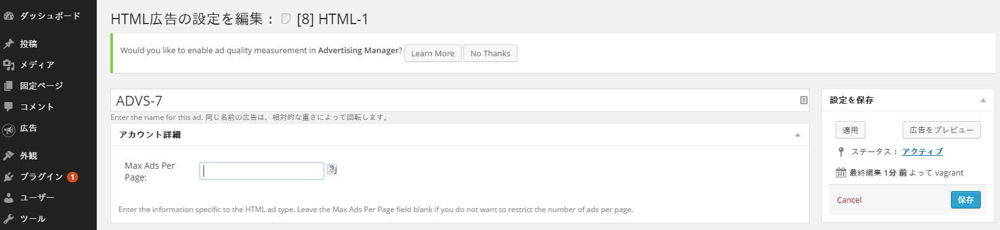

# 目次
- [WordPressプラグイン「Advertising Manager」のインストール](#install)
  - [「Advertising Manager」をインストールする](#install1)
  - [「Advertising Manager」を有効にする](#install2)
- [「Advertising Manager」の設定](#setup)
  - [テーマの編集](#setup1)
    - [テンプレートへのコードの追加](#setup1-1)
  - [「Adveritising Manager」の広告枠設定](#setup2)
    - [広告テンプレートと呼出用タグの設定](#setup2-1)
    - [広告設置位置指定タグの設定](#setup2-2)


WordPress にプラグインを用いてインフィード広告を導入する方法を説明します。


<a name="install"></a>
# WordPressプラグイン「Advertising Manager」のインストール

<a name="install1"></a>
## 「Advertising Manager」をインストールする

一般的なやり方は下記の3通りになります。

### WordPress管理画面上でプラグイン検索してインストールする方法

- WordPress管理画面の「プラグイン＞新規追加」で「advertising-manager」を検索する
- Scott Switzer作の「Advertising Manager」を「いますぐインストール」でインストールする


### プラグインのZIPファイルを指定してインストールする方法

- [WordPressプラグイン「Advertising Manager」](https://wordpress.org/plugins/advertising-manager/)からプラグインのZIPファイルをダウンロードする
- WordPress管理画面の「プラグイン＞新規追加」で「プラグインのアップロード」を選択する
- プラグインのZIPファイルを指定して「いますぐインストール」でインストールする


### サーバに直接アップする方法

- [WordPressプラグイン「Advertising Manager」](https://wordpress.org/plugins/advertising-manager/)からプラグインのZIPファイルをダウンロードする
- ZIPファイルを WordPressがインストールされているディレクトリの `wp-contents/plugins`ディレクトリにアップする
- ZIPファイルを解凍する


<a name="install2"></a>
## 「Advertising Manager」を有効にする

WordPress管理画面の「プラグイン＞インストール済みプラグイン」で「宣伝マネージャ」(Advertising Manager)を「有効」にしてください。


<a name="setup"></a>
# 「Advertising Manager」の設定

<a name="setup1"></a>
## テーマの編集

テーマを編集し、広告を表示させたいフィード部分にコードを追加します。

例として、WordPressインストール初期状態のフィード一覧ページのテンプレートは以下の 3 つです。

- メインインデックステンプレート (``index.php``)
- 検索結果テンプレート (``search.php``)
- アーカイブテンプレート (``archive.php``)


<a name="setup1-1"></a>
### テンプレートへのコードの追加

- WordPress管理画面の「外観＞テーマの編集」で、編集するテンプレート(``index.php``や``search.php``、``archive.php`` など)を選択してください
- 下記を参考に 2 行のコードを追加してください
  - ループの終了直前の行に以下のコードを追加してください
    - `advman_ad('ADVS_xxx-' . (is_null($advs_xxx) ? ($advs_xxx = 1) : ++$advs_xxx));`
      - `xxx` は内容に応じた任意の名前をつけてください。例えば index ページならば `ADVS_index` など
      - `xxx` には半角英数字のみ使用できます
  - ループ終了後の行に以下のコードを追加してください
    - `advman_ad('ADVS_xxx');`
- 「ファイルを更新」を押してテンプレートの編集を終了してください

`index` のテンプレートにコードを追加する例

```php
	// Start the Loop.
	while ( have_posts() ) : the_post();

		/*
		 * Include the Post-Format-specific template for the content.
		 * If you want to override this in a child theme, then include a file
		 * called content-___.php (where ___ is the Post Format name) and that will be used instead.
		 */
		get_template_part( 'content', get_post_format() );

		advman_ad('ADVS_index-' . (is_null($advs_index) ? ($advs_index = 1) : ++$advs_index));	// ←この行を追加。

	// End the loop.
	endwhile;
	advman_ad('ADVS_index');													// ←この行を追加
```


<a name="setup2"></a>
## 「Adveritising Manager」の広告枠設定

<a name="setup2-1"></a>
### 広告テンプレートと呼出用タグの設定

#### テンプレート用タグの準備

広告枠のテンプレート用タグを準備してください。媒体様ごとに異なるテンプレートが必要です。詳しくは [こちら](https://github.com/mtburn/MTBurn-JavaScript-SDK-Install-Guide/blob/master/Programming_Guide.md#user-content-%E3%83%86%E3%83%B3%E3%83%97%E3%83%AC%E3%83%BC%E3%83%88%E3%81%AE%E8%A8%98%E8%BF%B0) を参照ください。

テンプレート用タグの例

```html
<div class="article">
	<div class="icon">
		<a href="{{click_url}}"></a>
	</div>
	<div class="contents">
		<h3>{{title}}</h3>
		<p>{{description}}</p>
		<span class="source">Sponsored</span>
	</div>
</div>
```

テンプレート内で使うことができるパラメータは [こちら](https://github.com/mtburn/MTBurn-JavaScript-SDK-Install-Guide/blob/master/Programming_Guide.md#user-content-%E5%BA%83%E5%91%8A%E3%83%91%E3%83%A9%E3%83%A1%E3%83%BC%E3%82%BF) を参照ください。

#### テンプレート用タグと呼出用タグの入稿

WordPress管理画面の「広告＞新規作成」で、下記のコードを貼り付けて「インポート」してください。

```html
<script type="text/advs-instream-template" data-adspot-id="広告枠ID">
<!-- ここに先ほど準備した広告テンプレートを貼り付けてください -->
</script>
<script src="//js.mtburn.com/advs-instream.js"></script>
<script>MTBADVS.InStream.Default.run();</script>
```


- `ここに先ほど準備した広告テンプレートを貼り付けてください` 部分に、さきほど準備いただいた広告テンプレートを貼り付けてください。また広告を表示する際の文字数などは、この時点での設定が必要です。詳しくは [こちら](https://github.com/mtburn/MTBurn-JavaScript-SDK-Install-Guide/blob/master/Programming_Guide.md#user-content-%E5%BA%83%E5%91%8A%E3%82%BF%E3%82%A4%E3%83%88%E3%83%AB%E8%AA%AC%E6%98%8E%E6%96%87%E3%81%AE%E7%9F%AD%E7%B8%AE) を参照ください。
- `広告枠ID` の部分には、管理画面で発行した広告枠 ID を入力してください。


インポート後、「HTML広告の設定を編集」画面になります。

- `HTML` を `ADVS_xxx` に変更してください
  - `xxx` の部分は [テーマの編集](#setup1) で決めた名前に変更してください。今回の例では `ADVS_index` となります
- 「アカウント詳細＞Max Ads Per Page」を「1」に変更してください
- 「保存」を押して登録を完了してください


<a name="setup2-2"></a>
### 広告設置位置指定タグの設定

WordPress管理画面の「広告＞新規作成」で、下記のコードを貼り付けて「インポート」してください。

```html
<div data-advs-adspot-id="広告枠ID" style="display:none"></div>
```


- `広告枠ID` の部分には、広告テンプレート用タグと同様の、管理画面で発行した広告枠 ID を入力してください。

インポート後、「HTML広告の設定を編集」画面になります。

- `HTML` を `ADVS_xxx-<表示位置>` に変更してください。
  - `xxx` の部分は [テーマの編集](#setup1) で決めた名前に変更してください。今回の例では `ADVS_index` となります
  - `<表示位置>` には整数を入れてください。設定した数値の次のフィードにインフィード広告が表示されます
- 「保存」を押して登録を完了してください



同じフィード内にさらに広告を設置する場合は、[広告設置位置指定タグの設定](#setup2-2) を必要個数分実行してください。


**これで設定は完了です。**

変更したテンプレートの画面で、インフィード広告が表示されるかご確認ください。
